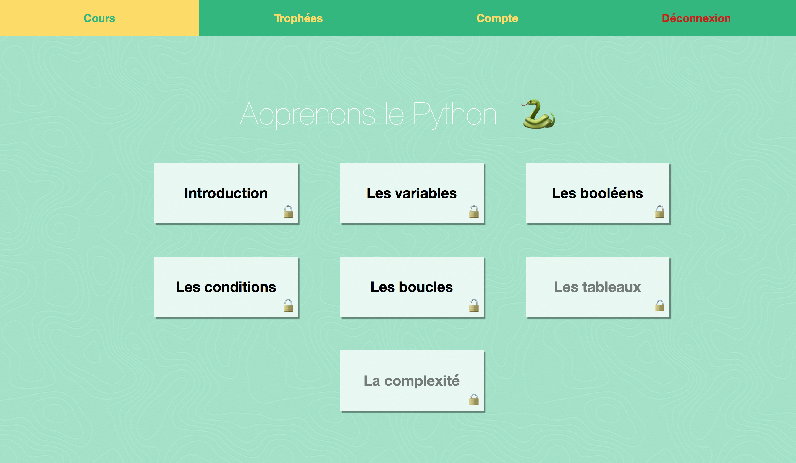

# codIT

codIT is a learning site for the programming in Python.

This is one of the projects of my second year at the Haute École en Hainaut for the _Projects Management_ course.

It's written in HTML/CSS and PHP. There're some JavaScript _(and jQuery)_ effects.  
The database was created with MySQL.

The code is [here](site).  
And the report is [here](https://github.com/Harchytekt/Rapports/blob/master/2015-2018%20(HeH)/2016-2017/Gestion%20de%20projets/Rapport.pdf)

